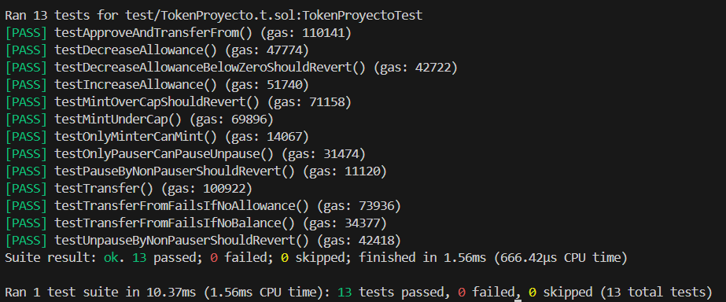

# 🪙 TokenProyecto

Este proyecto implementa un token ERC20 personalizado usando la librería OpenZeppelin Contracts v5, con funcionalidades avanzadas como *pausar*, *quemar*, *firmas off-chain (ERC20Permit)* y *control de roles* mediante AccessControl. Se desarrolló y probó completamente en el entorno de desarrollo **Foundry**.

---

## ✨ Características

* 🔐 Control de roles (`AccessControl`):

  * `DEFAULT_ADMIN_ROLE`
  * `MINTER_ROLE`: Puede acuñar tokens (`mint`)
  * `PAUSER_ROLE`: Puede pausar y reactivar el contrato

* 🔥 Funcionalidad para quemar tokens (`ERC20Burnable`)

* ⏸️ Posibilidad de pausar operaciones (`ERC20Pausable`)

* 📝 Soporte para firmar permisos (`ERC20Permit`)

* 💰 **Supply cap**: El total de tokens nunca puede exceder `1_000_000 * 10**18`

* ✅ Funciones `increaseAllowance` y `decreaseAllowance` incluidas para evitar *race conditions*

---

## 🧱 Contrato principal: `TokenProyecto.sol`

El contrato hereda las siguientes extensiones de OpenZeppelin:

```solidity
ERC20, ERC20Burnable, ERC20Pausable, AccessControl, ERC20Permit
```

Además, define el CAP máximo de tokens como:

```solidity
uint256 public constant CAP = 1_000_000 * 10**18;
```

Funciones clave:

* `mint`: Solo cuentas con `MINTER_ROLE` pueden acuñar tokens hasta alcanzar el CAP.
* `pause` / `unpause`: Controlado por `PAUSER_ROLE`.
* `increaseAllowance` y `decreaseAllowance`: Aumentan o reducen los allowances de forma segura.
* `ERC20FailedDecreaseAllowance`: Error personalizado si se intenta disminuir el allowance por debajo de lo permitido.

---

## ✅ Pruebas automatizadas con Foundry

Todas las funcionalidades se prueban en el archivo `TokenProyecto.t.sol`, utilizando el framework [Foundry](https://book.getfoundry.sh/).

Los tests cubren:

### 🔹 Minting

* ✅ Acuñación bajo el CAP actualiza `totalSupply` y `balanceOf`
* 🚫 Rechazo si la acuñación excede el CAP

### 🔹 Roles

* 🚫 Solo cuentas con `MINTER_ROLE` pueden llamar `mint`
* 🚫 Solo cuentas con `PAUSER_ROLE` pueden pausar o reactivar el contrato

### 🔹 Transfers & Allowances

* ✅ `transfer` y `transferFrom` actualizan correctamente los balances
* 🚫 `transferFrom` falla si el allowance o el balance es insuficiente
* ✅ `increaseAllowance` y `decreaseAllowance` funcionan correctamente
* 🚫 `decreaseAllowance` falla con un error personalizado si se reduce más allá del límite

---

## 🧪 Ejecución de tests

```bash
forge test -vv
```

> 📸 **Adjunto captura de pantalla**


---

## 🏗️ Despliegue

El contrato puede ser desplegado pasando las direcciones de `pauser` y `minter` en el constructor:

```solidity
constructor(address pauser, address minter)
```

> 📸 **Coloca una captura del contrato desplegado en una red local/testnet aquí (por ejemplo en Remix o con `forge script`).**

---

## 🖼️ Recomendaciones para capturas de pantalla

1. **Tests exitosos con Foundry:**

   * Ubicación: al final de la sección "🧪 Ejecución de tests"
   * Muestra: ejecución de `forge test` donde todos los tests pasen satisfactoriamente.

2. **Roles y pausado:**

   * Ubicación: después de la sección "🔹 Roles"
   * Muestra: console.log o trazas donde se prueba `pause` y `unpause` por el `pauser`.

3. **Reversión por exceder el CAP:**

   * Ubicación: después de "🚫 Rechazo si la acuñación excede el CAP"
   * Muestra: error revertido por exceder el `CAP`.

4. **Fallos por allowance insuficiente:**

   * Ubicación: después de "🚫 `transferFrom` falla si el allowance..."
   * Muestra: ejecución de test que lanza revert al intentar transferir sin allowance.

---

## 📂 Estructura del proyecto

```
.
├── src/
│   └── TokenProyecto.sol
├── test/
│   └── TokenProyecto.t.sol
├── foundry.toml
├── README.md
```

---

## 🛠️ Requisitos

* Solidity ^0.8.13
* OpenZeppelin Contracts ^5.0.0
* Foundry (`forge`, `cast`) instalado

---

## 🚀 Comandos útiles de Foundry

```bash
forge build         # Compila el proyecto
forge test -vv      # Ejecuta tests con trazas detalladas
forge clean         # Limpia la cache
```

---

## 📜 Licencia

MIT